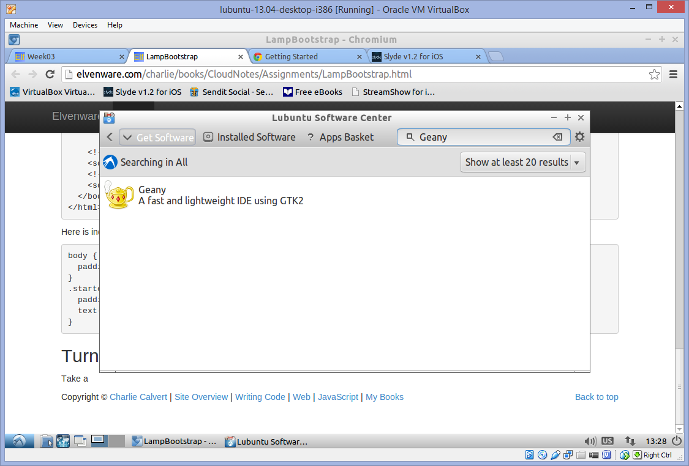

Install LAMP
============

The goal of this assignment is to install LAMP on your copy of 
VirtualBox. Then replace the default index.html file with default
page from Bootstrap site. Remove the default text on the page,
and replace it with a paragraph of your own.

LAMP
----

Lamp is the primary platform of the web. It is an acronym for: Linux - Apache -
MySQL - Python/Php/Perl. Both WordPress and MediaWiki depend on LAMP.

To install, from the Linux prompt, follow these instructions:

-   <http://www.elvenware.com/charlie/development/database/mysql/MySql.html#installOnLinux>

Bootstrap
---------

You do not need to actually write any HTML or CSS to complete this
assignment. However, I want you to include the following code
verbatim. Or nearly verbatim. Find the places in the HTML file 
where it says **Lastname** and replace them with your lastname. Also,
find this text:

	<p>This is a document</p>
	
Replace the parts between \<p\> and \<\/p\> with the first paragraph
from your introduction that you published in the discussion area. For
instance:

	<p>I'm Charlie Calvert and I'm your teacher. I've been working with 
	computers and writing code in one form or another for about 25 
	years. I started out with Turbo Pascal and Delphi, spent time with 
	Java, C++, Python and Perl, and then spent a number of years working 
	in C#. Now my primary focus is on JavaScript.</p>

Put the files in: **/var/www**, replacing the index.html that is there
by default.

Here is the HTML to put in a file called **index.html**:

```
<!DOCTYPE html>
<html>
  <head>
  	<meta charset="utf-8">
    <title>Prog280 Template</title>
    <meta name="description" content="Prog280 Starter Template">
    <meta name="author" content="Lastname">
    <meta name="viewport" content="width=device-width, initial-scale=1.0">
    <!-- Bootstrap -->
    <link href="bootstrap.css" rel="stylesheet">
    <!-- Custom styles for this template -->
    <link href="index.css" rel="stylesheet">
  </head>
  <body>
  
    <div class="navbar navbar-inverse navbar-fixed-top" role="navigation">
      <div class="container">
        <div class="navbar-header">
          <button type="button" class="navbar-toggle" data-toggle="collapse" data-target=".navbar-collapse">
            <span class="sr-only">Toggle navigation</span>
            <span class="icon-bar"></span>
            <span class="icon-bar"></span>
            <span class="icon-bar"></span>
          </button>
          <a class="navbar-brand" href="#">Prog280-Lastname</a>
        </div>
        <div class="collapse navbar-collapse">
          <ul class="nav navbar-nav">
            <li class="active"><a href="#">Home</a></li>           
          </ul>
        </div><!--/.nav-collapse -->
      </div>
    </div>


    <div class="container">
        <h1>Prog 280 Lastname</h1>

        <p>This is a document</p>
    </div> <!-- Container -->

    <!-- jQuery (necessary for Bootstrap's JavaScript plugins) -->
    <script src="https://code.jquery.com/jquery.js"></script>
    <!-- Include all compiled plugins (below), or include individual files as needed -->
    <script src="js/bootstrap.min.js"></script>
  </body>
</html>
```

Here is the CSS to put in a file called **index.css**.:

```
body {
  padding-top: 50px;
}
.starter-template {
  padding: 40px 15px;
  text-align: center;
}
```

Create Files on Linux
---------------------

You should probably start by installing Geany. From the Lubuntu menu
choose **System Tools | Lubuntu Software Center**.


In the Software Center, choose to install Geany. You can search for 
it by typing its name in the editor control on the right. 
Alternatively, look under the category in the **Software Center** 
called **Developer Tools**.



Put Geany in the **Apps Basket**. Switch to the **Apps Basket** view
and choose **Install Packages**. (Remember that the default password
for your copy of Lubuntu is the same as the user name.)

We are now about to create some files on Lubuntu. The question of where
to put the files is largely up to you. The most important thing is
have a logical system. For now, however, I suggest that you place your
files in your **Documents** folder in a subdirectory called **Site**.

	/home/adminuser/Documents/Site

In the Lubuntu Start menu, you should have a new item entitled 
**Programming**. Geany will be available in that menu folder. Open 
Geany, and paste the HTML for this assignment into the editor. Save 
it into **Documents/Site** as **index.html**. Create a new file in 
Geany and paste the CSS into it. Save it in **Documents/Site** as 
**index.css**.


Here is what Geany should look like once **index.html** is successfully
saved in **Documents/Site**.


Create the **index.css** in Geany. Save it just as you did 
**index.html**. You should also edit **index.html** so it contains
the proper content including your last name and the first paragraph
from your introduction.

Open the Lubuntu Chromium browser and download **bootstrap.css** 
from the bootstrap site and also place it in **Documents/Site**:

- <http://getbootstrap.com/dist/css/bootstrap.css>

Now you need to copy all three files **index.html**, **index.css** and
**bootstrap.css** into **/var/www**. The **/var/www** folder is where
the Apache Web Server serves up HTML files. You will need to use both
**sudo** and **cp** to perform this operation. The quizes you took
earlier are designed to help you perform these operations.


When you have copied all three files in **/var/www**, go back to the
browser and use the address bar to navigate to:

	http://localhost
	
You should see your file in the browser, as shown below:


Turn it in
----------

Go back to Windows and use the Snipping Tool that comes with Windows 
to take a screen shot of your copy of index.html running in 
VirtualBox and Lubuntu. The screen shot should look a lot like the 
image shown at the end of the last section, only it will have your 
lastname and a description from your introduction. Submit this 
screenshot to complete the assignment.
